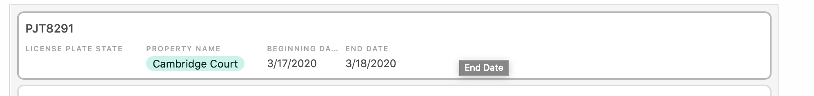

# Campus Pathfinder

__Final Project Writeup__

Troy DeSpain

## About this Project

I developed an application that allows the user to find the best path to take when walking between any two points on USU campus. It can function as a simple pathfindinder displaying the shortest path between any two points, including walking through buildings as necessary. A more exciting feature allows the user to prioritize walking indoors during cold weather to keep warm. The amount of priority given to walking indoors can be adjusted to any value using a continuous slider input. To help the user decide how much priority to place on walking indoors, the current temperature on campus is displayed in the top right corner. 

There are two methods that can be used to select starting and ending points for the pathfinding algorithm: 

1. The user can click directly on the graph to choose starting and ending points of the path.

2. Combo boxes can be used to select which buildings to start and end at. Since most buildings have multiple public entrances, the algorithm will all combinations of paths between all doors, then only display the shortest path to the user. 

## Application Design

I built this program following the Model-View-Controller design paradigm. The structure of my view is defined using FXML and styled using CSS. View controllers dynamically load images and other data into the view when the application loads. The graph data for all the possible paths on campus is stored externally in JSON files, then loaded into RAM on startup.

Below is a UML Diagram of the structure of my Java classes:

## Project Requirements

### JavaFX Panes (2)

| __Pane__ | __Implementation__ |
|----------|--------------------|
|BorderPane| The top level pane in my application is a BorderPane which has content in top, left, and center. The admin application puts tools in the bottom instead of the left |
| VBox | The content in the left BorderPane section is placed in a HBox |
| HBox | The content in the top and bottom BorderPane sections are placed in HBox(s) |
| Pane | The center section of the BorderPane contains two Pane(s) stacked on top of one another. The bottom Pane contains the ImageView to display the map, while the top Pane contains the lines dynamically drawn by the program to display paths. |

### JavaFX Nodes (6)

| __Node__ | __Implementation__ |
|----------|--------------------|
| Line | A group of lines are used to display the best walking to the user |
| Circle | Circle(s) mark the start and end points of the walking path |
| ComboBox | ComboBox(s) allow the user to select buildings to start and end at |
| Label | Labels instruct the user what the different inputs are for |
| Slider | A slider allow the user to adjust how much priority is given to walking indoors |
| ImageView | The ImageView holds the picture showing the map of campus |
| Text | Text fields display the current temperature as well as the length of the path |

### Animation or A/V

There are no animations currently implemented, but maybe I'll have a box displaying the path length slide in after a path is found.

### Events, Listeners, and Bindings

* Events are used to trigger the pathfinding algorithm to run whenever a change is made to one of the inputs. Events are also triggered when the user clicks on the map to draw custom start and endpoints for the path. 

* When the user types text to search for a specific building, a listener is used to detect changes to the editable ComboBox as the text is typed.

* Still thinking of what to use a binding for. 

### Server-Client Connection

Campus Pathfinder displays the current temperature on campus in order to help the user decide how much priority should be placed on walking indoors. I accomplished this by making an API call to ClimaCell. Since the free version of this API is limited to only 100 requests per day, the API call is only made at most once every 20 minutes. The time and result of the API call is stored in the file settings.json so it can remember the weather even if the application is restarted. 

Create a Word Document, or PowerPoint, or another format which clearly displays the following information.  I am not so much worried about the format of this HW assignment, as much as seeing how your project is coming together.

Include:

Which Project you are working on (Chess/Sudoku/Web Browser/Other)

Group Members

A high-level explanation of what each group member will be doing.  It's OK if this changes later, but I want to see a plan.

Design and/or layout of your JavaFX Application.  This can be done in Word, or Powerpoint, or even hand-drawn and turned in as an image.

Brief explanation how each of the following requirements are being met:

 

Project Requirements

At least 2 types JavaFX Panes organized well, to give your GUI a nice appearance and usability. (30 points)

At least 6 types of JavaFX Nodes, i.e. Buttons, TextField, Labels, CheckBoxes, RadioButtons, ImageView, etc. (30 points)

Animation i.e. Timeline or FadeTransition.  Or a video/audio component. (15 points)

Events (20 points)

Bindings (20 points)

Listeners (20 points)

Server-Client, or Client-Client connectivity (15 points)

